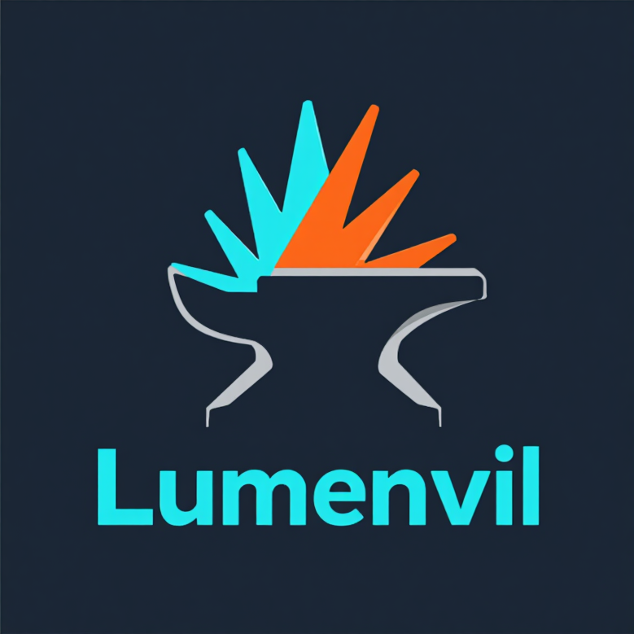

# Lumenvil

<div align="center">




**Self-hosted Unity build automation system for PC/Steam games**

*Where builds come to light*

[](https://dotnet.microsoft.com/)
[](https://nextjs.org/)
[](https://www.typescriptlang.org/)
[](https://www.sqlite.org/)
[](LICENSE)

</div>

---

## Overview

Lumenvil is a complete build automation solution designed for game development teams. Run Unity builds on a dedicated Windows machine, monitor progress in real-time from any device, and deploy directly to Steam.

```
┌─────────────┐      ┌─────────────┐      ┌─────────────┐
│  Dashboard  │◄────►│   Backend   │◄────►│ Build Agent │
│  (Next.js)  │      │  (.NET API) │      │  (Windows)  │
└─────────────┘      └─────────────┘      └─────────────┘
     Any Device         SignalR              Unity + Steam
```

---

## Features

### Build Automation
- **IL2CPP & Mono** scripting backend support
- **Git integration** with branch selection
- **Build templates** for quick, repeatable builds
- **Queue system** for managing multiple builds

### Real-time Monitoring
- **Live build logs** streaming via SignalR
- **Progress tracking** with stage indicators
- **Toast notifications** for build events
- **Multi-client sync** - watch from multiple devices

### Steam Integration
- **Automatic upload** via SteamCMD
- **Branch selection** (default, beta, staging)
- **Upload status tracking** in dashboard

### Notifications
- **Discord** webhooks with rich embeds
- **Slack** webhooks with formatted messages
- **Custom webhooks** with HMAC signing
- **Per-project overrides** for notification settings

### Storage Management
- **Automatic cleanup** of old builds
- **Disk space monitoring** with alerts
- **Configurable retention** (by age or count)
- **Steam upload protection** - keep deployed builds

### User Management
- **Role-based access**: Admin, Developer, Viewer
- **JWT authentication**
- **User invitation** system

---

## Tech Stack

| Component | Technology |
|-----------|------------|
| **Backend** | .NET 6 Web API, SignalR, Entity Framework Core |
| **Dashboard** | Next.js 14, TypeScript, Tailwind CSS, shadcn/ui |
| **Build Agent** | .NET 6 Background Service |
| **Database** | SQLite |
| **Real-time** | SignalR WebSockets |

---

## Quick Start

### Prerequisites
- .NET 6 SDK
- Node.js 18+
- Unity (on build machine)
- Git

### 1. Clone & Setup
```bash
git clone https://github.com/yourusername/lumenvil.git
cd lumenvil

# Backend
cd src/Backend
cp .env.example .env  # Edit with your settings
dotnet restore

# Dashboard
cd ../Dashboard
npm install
```

### 2. Start All Services
```bash
./start.sh
```

Or manually:
```bash
# Terminal 1: Backend
cd src/Backend && dotnet run

# Terminal 2: Dashboard
cd src/Dashboard && npm run dev

# Terminal 3: Build Agent (Windows)
cd src/BuildAgent && dotnet run
```

### 3. Access Dashboard
Open `http://localhost:3000`

Default credentials:
- Username: `admin`
- Password: `admin123`

---

## Architecture

```
lumenvil/
├── src/
│   ├── Backend/           # .NET Web API
│   │   ├── Controllers/   # REST endpoints
│   │   ├── Hubs/          # SignalR hub
│   │   ├── Models/        # Data models
│   │   └── Services/      # Business logic
│   │
│   ├── BuildAgent/        # Windows build service
│   │   └── Services/      # Git, Unity, Upload
│   │
│   └── Dashboard/         # Next.js frontend
│       ├── app/           # Pages (App Router)
│       ├── components/    # UI components
│       └── lib/           # Utilities
│
└── start.sh               # Development startup script
```

---

## Configuration

### Environment Variables (Backend)
```env
# JWT
JWT_KEY=your-super-secret-key-min-32-characters
JWT_ISSUER=Lumenvil
JWT_AUDIENCE=Lumenvil

# Admin
ADMIN_USERNAME=admin
ADMIN_PASSWORD=change-this-password
ADMIN_EMAIL=admin@example.com
```

### Build Agent (appsettings.json)
```json
{
  "HubUrl": "http://localhost:5000/hubs/build",
  "AgentName": "windows-builder",
  "UnityHubPath": "C:\\Program Files\\Unity\\Hub\\Editor",
  "BuildOutputBase": "./builds",
  "WorkspacePath": "./workspace"
}
```

---

## Remote Access

### Option 1: Cloudflare Tunnel (Recommended)
```bash
cloudflared tunnel run lumenvil
```
Access via `https://lumenvil.yourdomain.com`

### Option 2: Tailscale
Install on all devices, access via Tailscale network.

### Option 3: Direct Port Forward
Open ports 3000 (Dashboard) and 5000 (API) on your router.

---

## API Endpoints

| Endpoint | Description |
|----------|-------------|
| `POST /api/auth/login` | User authentication |
| `GET /api/project` | List projects |
| `POST /api/build` | Start new build |
| `GET /api/build/{id}` | Build details + logs |
| `POST /api/build/{id}/cancel` | Cancel build |
| `GET /api/settings/steam` | Steam configuration |
| `GET /api/settings/cleanup` | Cleanup settings |
| `GET /api/settings/disk` | Disk space info |

Full API documentation available at `/swagger` when running in development.

---

## Roadmap

- [ ] Parallel builds with library caching
- [ ] Email notifications (SMTP)
- [ ] Build analytics & statistics
- [ ] Windows Service installer
- [ ] Docker deployment

---

## License

MIT License - see [LICENSE](LICENSE) for details.

---

<div align="center">

**Built for game developers, by game developers**

</div>
