# Lumenvil Dashboard Guide

A comprehensive guide to using the Lumenvil Dashboard for Unity build automation.

---

## Table of Contents

- [Dashboard Overview](#dashboard-overview)
- [Projects](#projects)
- [Builds](#builds)
- [Build Templates](#build-templates)
- [Build Pipelines](#build-pipelines)
- [Users](#users)
- [Settings](#settings)

---

## Dashboard Overview

The main dashboard provides a quick overview of your build automation system.

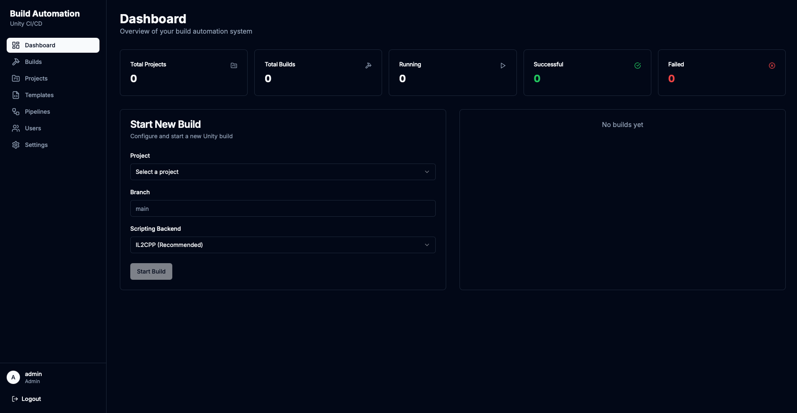

**Key Components:**

| Component | Description |
|-----------|-------------|
| **Total Projects** | Number of Unity projects configured |
| **Total Builds** | Total builds executed |
| **Running** | Currently running builds |
| **Successful** | Completed builds without errors |
| **Failed** | Builds that encountered errors |

**Quick Actions:**
- Start a new build directly from the dashboard
- Select project, branch, and scripting backend (IL2CPP/Mono)
- View recent build activity

---

## Projects

Manage your Unity projects in the Projects section.

### Projects List


Each project card displays:
- Project name and description
- Unity version
- Default branch
- Total builds and success count
- Quick actions (View Builds, Edit, Delete)

### Create New Project

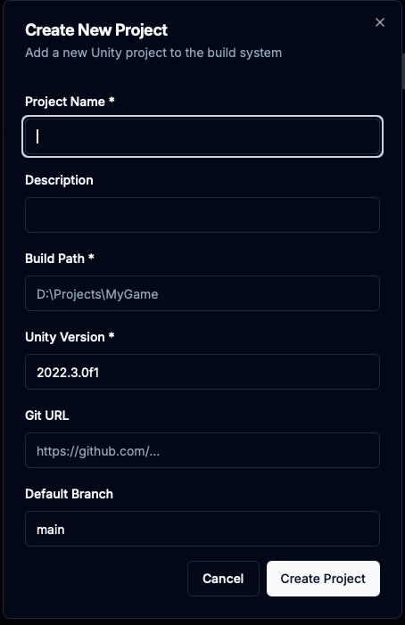

**Required Fields:**
| Field | Description | Example |
|-------|-------------|---------|
| **Project Name** | Display name for the project | `My Game` |
| **Build Path** | Local path to Unity project | `D:\Projects\MyGame` |
| **Unity Version** | Unity Editor version | `2022.3.0f1` |

**Optional Fields:**
| Field | Description |
|-------|-------------|
| **Description** | Project description |
| **Git URL** | Repository URL for automatic cloning |
| **Default Branch** | Branch to use when not specified |

---

## Builds

View, manage, and monitor your Unity builds.

### Builds List

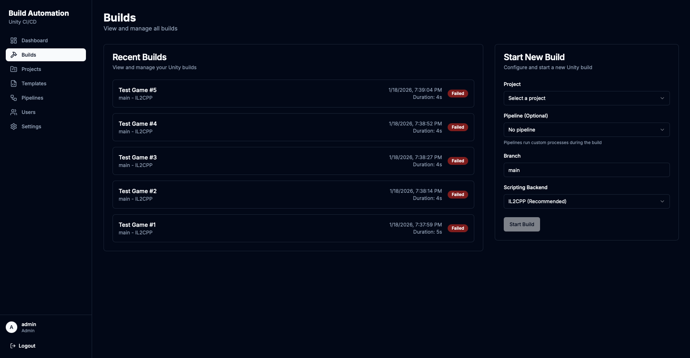

**Features:**
- View all recent builds with status indicators
- Filter by project, status, or date
- Start new builds with pipeline selection
- Click any build to view details

**Build Statuses:**
| Status | Color | Description |
|--------|-------|-------------|
| Queued | Gray | Waiting to start |
| Cloning | Blue | Pulling from Git |
| Building | Blue | Unity build in progress |
| Packaging | Blue | Creating build package |
| Uploading | Blue | Uploading to Steam |
| Success | Green | Completed successfully |
| Failed | Red | Build encountered errors |
| Cancelled | Orange | Manually cancelled |

### Build Detail & Live Logs

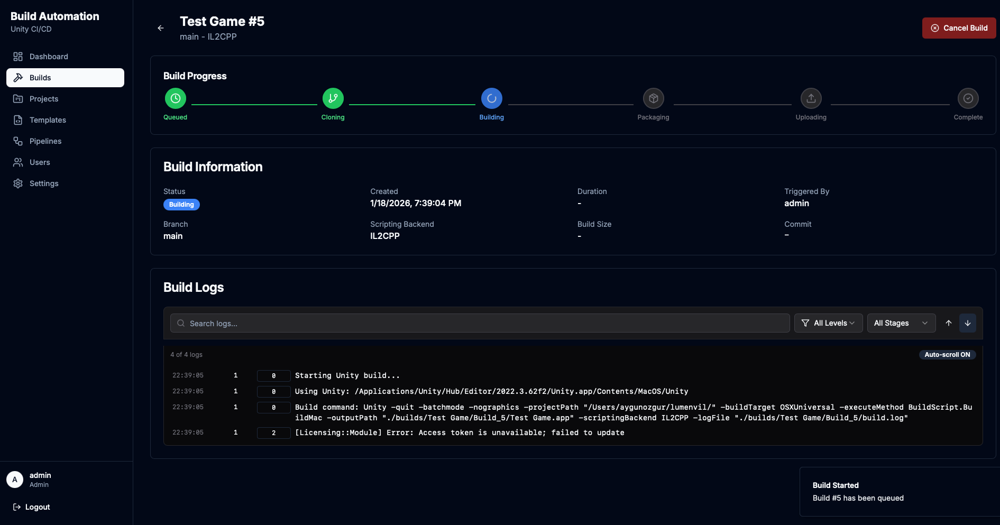

**Build Progress Tracker:**
- Visual pipeline showing current stage
- Stages: Queued → Cloning → Building → Packaging → Uploading → Complete

**Build Information Panel:**
| Field | Description |
|-------|-------------|
| Status | Current build status with badge |
| Created | When the build was triggered |
| Duration | Total build time |
| Triggered By | User who started the build |
| Branch | Git branch being built |
| Scripting Backend | IL2CPP or Mono |
| Build Size | Final build size (after completion) |
| Commit | Git commit hash |

**Live Build Logs:**
- Real-time log streaming via SignalR
- Search logs with keyword filter
- Filter by log level (Info, Warning, Error)
- Filter by stage (Clone, Build, Package, Upload)
- Auto-scroll toggle for following new logs
- Color-coded log levels for easy scanning

---

## Build Templates

Save your build configurations for quick, repeatable builds.

### Templates Page

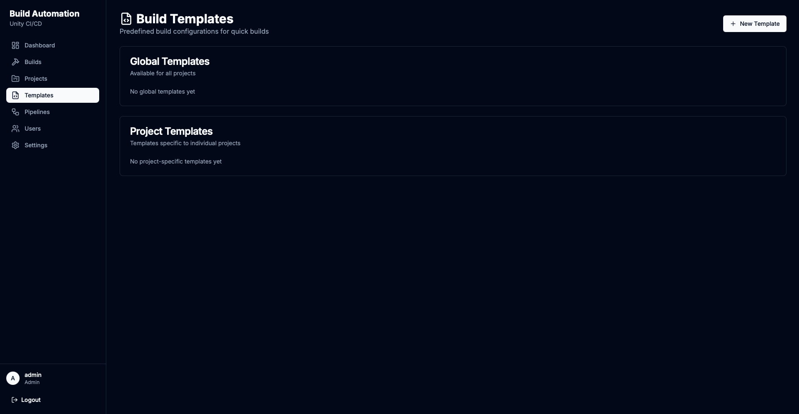

**Template Types:**

| Type | Scope | Description |
|------|-------|-------------|
| **Global Templates** | All projects | Available for any project |
| **Project Templates** | Single project | Specific to one project |

### Create Template

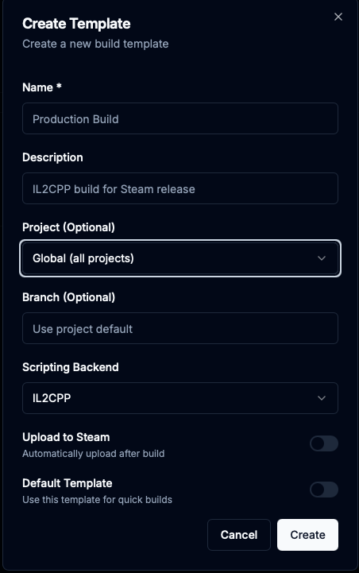

**Template Configuration:**

| Field | Description |
|-------|-------------|
| **Name** | Template display name |
| **Description** | What this template is for |
| **Project** | Global or specific project |
| **Branch** | Git branch (or use project default) |
| **Scripting Backend** | IL2CPP or Mono |
| **Upload to Steam** | Auto-upload after build |
| **Default Template** | Use for quick builds |

**Use Cases:**
- `Production Build` - IL2CPP build with Steam upload
- `Development Build` - Quick Mono build for testing
- `Beta Build` - IL2CPP build to Steam beta branch

---

## Build Pipelines

Pipelines allow you to run custom processes before and after Unity builds.

### Pipelines Page

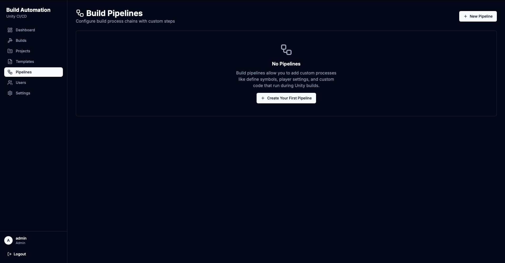

Pipelines contain a chain of processes that execute during the build lifecycle.

### Create Pipeline

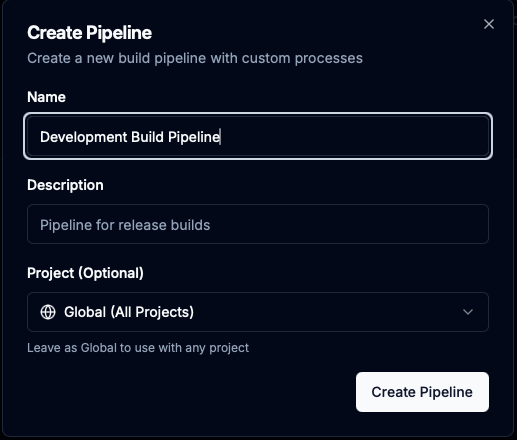

**Pipeline Settings:**
| Field | Description |
|-------|-------------|
| **Name** | Pipeline display name |
| **Description** | Pipeline purpose |
| **Project** | Global (all projects) or project-specific |

### Pipeline Detail - Process Chain

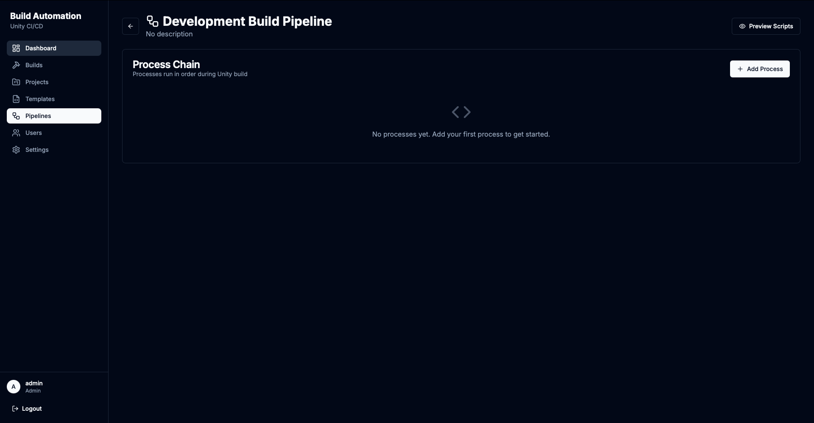

The Process Chain shows all processes in execution order. Processes run sequentially during the build.

### Adding Processes

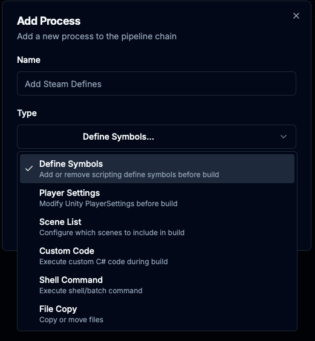

**Available Process Types:**

| Type | Phase | Description |
|------|-------|-------------|
| **Define Symbols** | Pre-Build | Add/remove scripting define symbols |
| **Player Settings** | Pre-Build | Modify Unity PlayerSettings |
| **Scene List** | Pre-Build | Configure build scenes |
| **Custom Code** | Both | Execute custom C# code |
| **Shell Command** | Both | Run shell/batch commands |
| **File Copy** | Post-Build | Copy or move files |

### Process Configuration Examples

#### Define Symbols


Add or remove scripting define symbols before the build starts.

**Configuration:**
```
Add Symbols (one per line):     Remove Symbols (one per line):
DEV_BUILD                       STEAMWORKS_ENABLED
DEBUG                           RELEASE_ENABLED
VERBOSE_LOG
```

**Use Cases:**
- Enable debug logging for development builds
- Disable analytics for test builds
- Toggle feature flags per build type

#### Shell Command

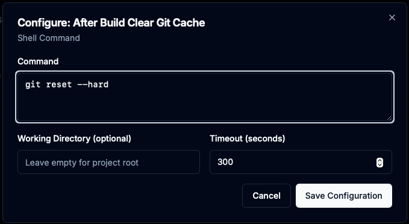

Execute shell commands or batch scripts during the build.

**Configuration:**
| Field | Description |
|-------|-------------|
| **Command** | Shell command to execute |
| **Working Directory** | Where to run (empty = project root) |
| **Timeout** | Max execution time in seconds |

**Example Use Cases:**
- `git reset --hard` - Clean working directory after build
- `npm run build` - Build web components
- Custom deployment scripts

#### File Copy

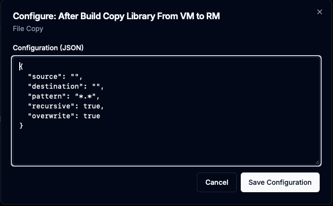

Copy or move files as part of the build process.

**Configuration (JSON):**
```json
{
  "source": "",
  "destination": "",
  "pattern": "*.*",
  "recursive": true,
  "overwrite": true
}
```

**Use Cases:**
- Copy build artifacts to network share
- Backup Library folder for caching
- Move builds to distribution folder

### Pipeline with Processes

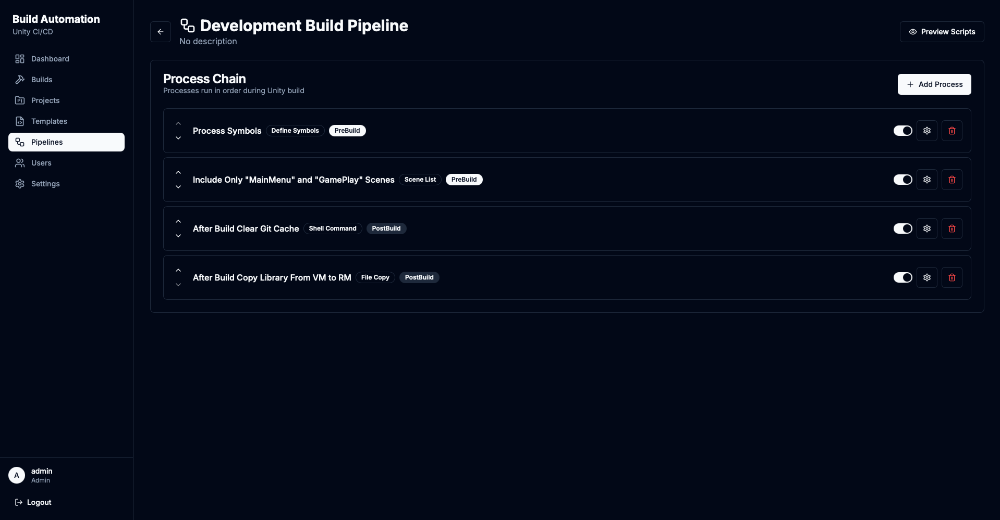

A complete pipeline showing multiple processes:

| Order | Process | Type | Phase |
|-------|---------|------|-------|
| 1 | Process Symbols | Define Symbols | PreBuild |
| 2 | Include Only "MainMenu" and "GamePlay" Scenes | Scene List | PreBuild |
| 3 | After Build Clear Git Cache | Shell Command | PostBuild |
| 4 | After Build Copy Library From VM to RM | File Copy | PostBuild |

**Process Controls:**
- Toggle enable/disable per process
- Configure process settings
- Delete process from chain
- Reorder with up/down arrows

### Generated Scripts Preview

Lumenvil auto-generates Unity Editor scripts from your pipeline configuration. These scripts are injected before build and removed after.

#### Pre-Build Script

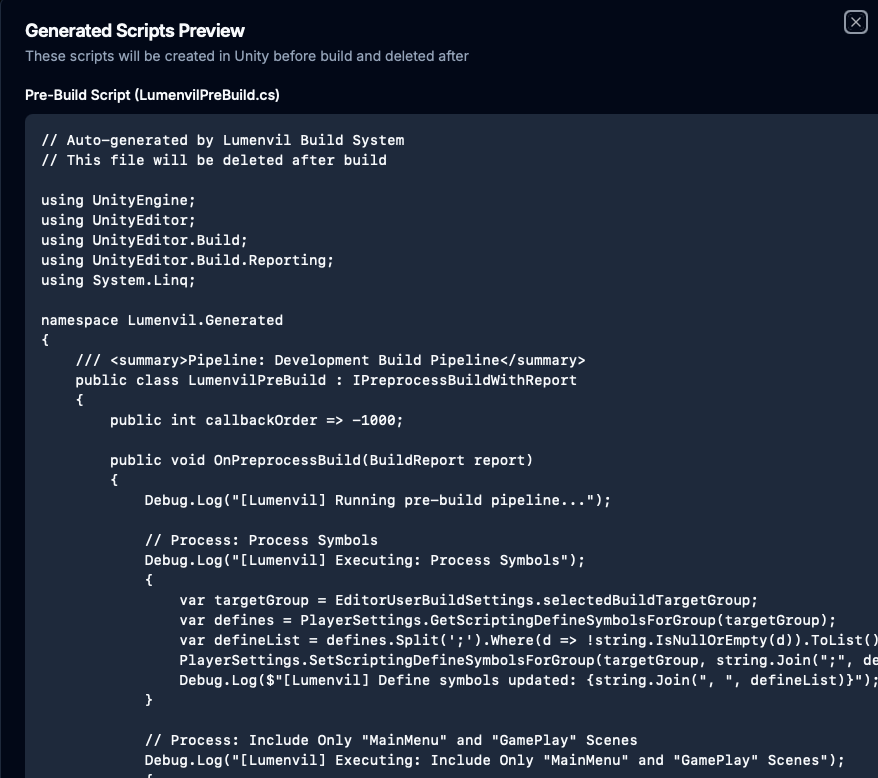

The pre-build script implements `IPreprocessBuildWithReport` and runs before Unity starts building.

**Generated Code Features:**
- Automatic using statements
- Pipeline name in XML summary
- Callback order for execution priority
- Process-specific code for each step

#### Post-Build Script

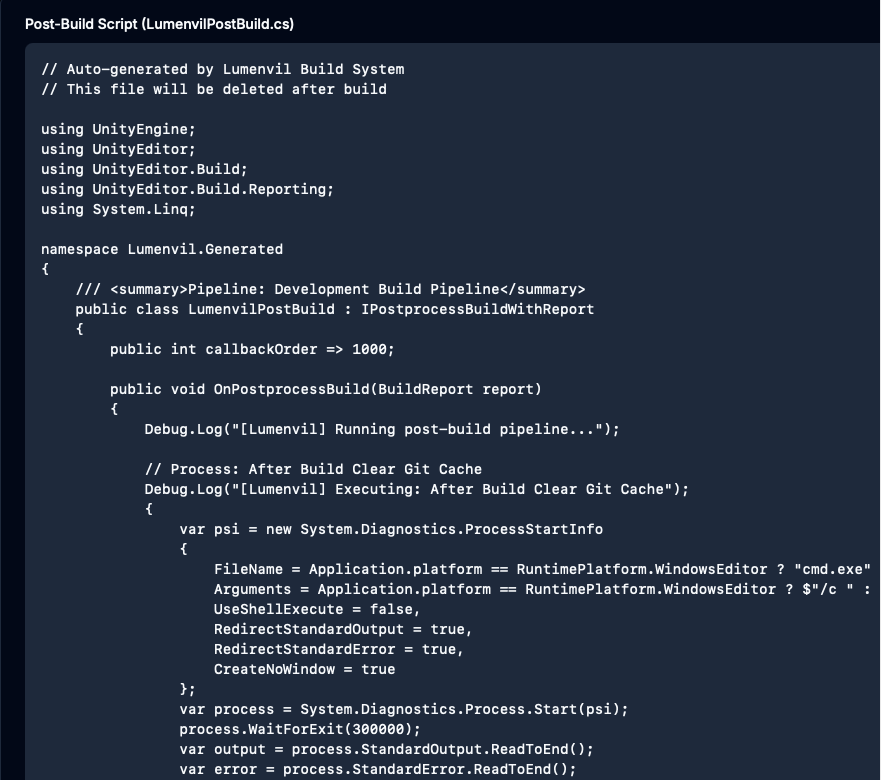

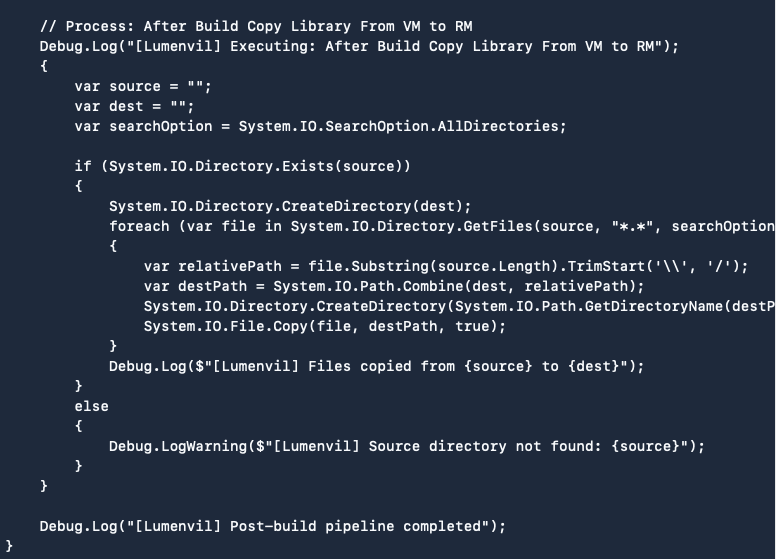

The post-build script implements `IPostprocessBuildWithReport` and runs after the build completes.

**Key Points:**
- Scripts are auto-generated based on your configuration
- Injected into `Assets/Editor/` before build
- Automatically deleted after build completes
- Cross-platform compatible (Windows/macOS/Linux)

---

## Users

Manage user accounts and permissions.

### User Management

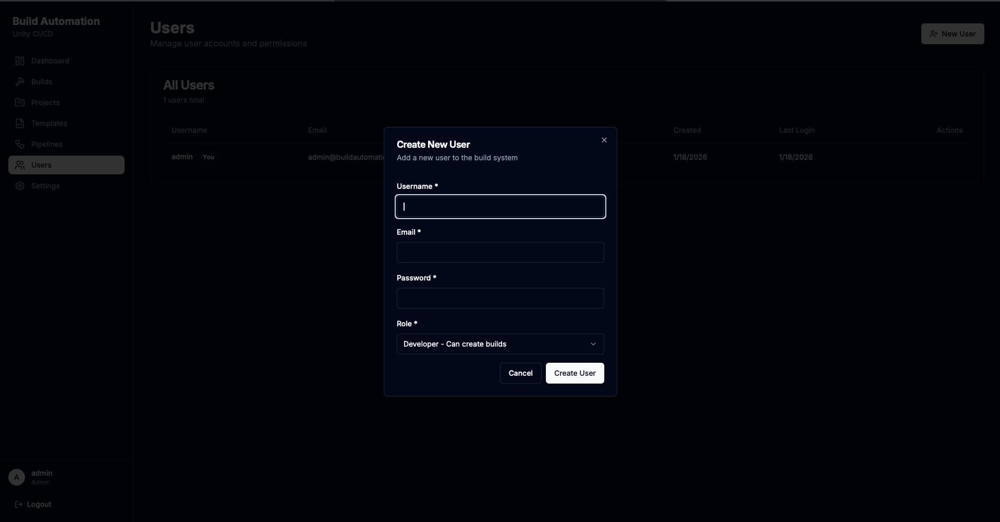

**User Roles:**

| Role | Permissions |
|------|-------------|
| **Admin** | Full access - manage users, settings, projects, builds |
| **Developer** | Can create builds and manage projects |
| **Viewer** | Read-only access to view builds and logs |

**Create User Fields:**
| Field | Required | Description |
|-------|----------|-------------|
| Username | Yes | Unique login name |
| Email | Yes | User email address |
| Password | Yes | Account password |
| Role | Yes | Permission level |

---

## Settings

Configure platform integrations and system settings.

### Platform Integrations - Steam

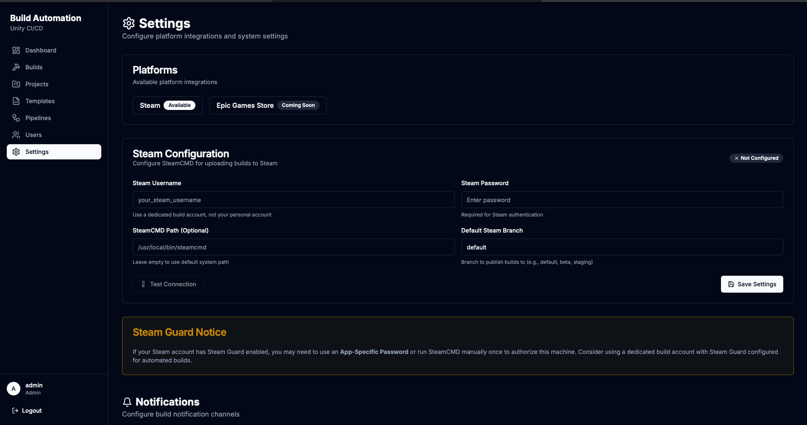

**Available Platforms:**
- Steam (Available)
- Epic Games Store (Coming Soon)

**Steam Configuration:**

| Setting | Description |
|---------|-------------|
| **Steam Username** | Dedicated build account (not personal) |
| **Steam Password** | Account password |
| **SteamCMD Path** | Path to SteamCMD (optional) |
| **Default Steam Branch** | Target branch (default, beta, staging) |

**Steam Guard Notice:**
> If your Steam account has Steam Guard enabled, you may need to use an App-Specific Password or run SteamCMD manually once to authorize this machine.

**Actions:**
- Test Connection - Verify Steam credentials
- Save Settings - Store configuration

### Notifications

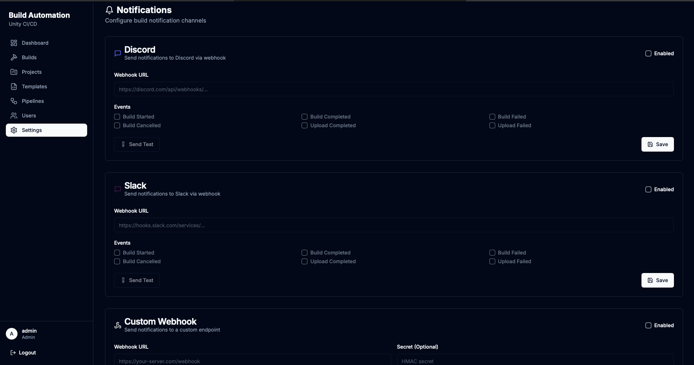

Configure build notification channels.

#### Discord

| Setting | Description |
|---------|-------------|
| **Webhook URL** | Discord webhook URL |
| **Events** | Build Started, Completed, Failed, Cancelled, Upload Completed/Failed |

#### Slack

| Setting | Description |
|---------|-------------|
| **Webhook URL** | Slack incoming webhook URL |
| **Events** | Same as Discord |

#### Custom Webhook

| Setting | Description |
|---------|-------------|
| **Webhook URL** | Your custom endpoint |
| **Secret** | HMAC secret for request signing (optional) |
| **Events** | Same as above |

**Actions:**
- Send Test - Send a test notification
- Save - Store webhook configuration

### Build Cleanup & Disk Space

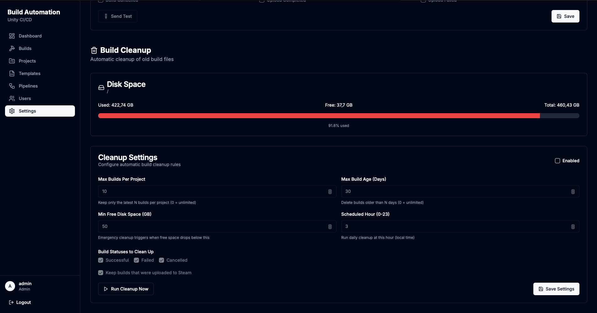

#### Disk Space Monitor

Visual indicator showing:
- Used space
- Free space
- Total capacity
- Usage percentage

#### Cleanup Settings

| Setting | Description | Default |
|---------|-------------|---------|
| **Max Builds Per Project** | Keep only N latest builds (0 = unlimited) | 10 |
| **Max Build Age (Days)** | Delete builds older than N days (0 = unlimited) | 30 |
| **Min Free Disk Space (GB)** | Emergency cleanup threshold | 50 |
| **Scheduled Hour** | Daily cleanup time (0-23) | 3 (3 AM) |

**Build Statuses to Clean Up:**
- Successful builds
- Failed builds
- Cancelled builds

**Protection:**
- Option to keep builds that were uploaded to Steam

**Actions:**
- Run Cleanup Now - Execute cleanup immediately
- Save Settings - Store cleanup configuration

---

## Keyboard Shortcuts

| Shortcut | Action |
|----------|--------|
| `Ctrl + N` | New Build |
| `Ctrl + P` | Go to Projects |
| `Ctrl + B` | Go to Builds |
| `Escape` | Close modal |

---

## Tips & Best Practices

1. **Use Templates** - Create templates for common build configurations to save time
2. **Pipeline for Releases** - Set up a release pipeline with define symbols and Steam upload
3. **Monitor Disk Space** - Enable automatic cleanup to prevent disk full errors
4. **Branch Naming** - Use consistent branch names across projects for easier template reuse
5. **Test Notifications** - Use the "Send Test" button to verify webhook configuration
6. **Steam Guard** - Use a dedicated build account with Steam Guard configured for this machine

---

<div align="center">

**Need help?** Open an issue on [GitHub](https://github.com/yourusername/lumenvil/issues)

</div>
